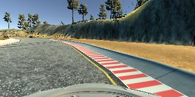

# **Behavioral Cloning**

**Behavioral Cloning Project**

The goals / steps of this project are the following:
* Use the simulator to collect data of good driving behavior
* Build, a convolution neural network in Keras that predicts steering angles from images
* Train and validate the model with a training and validation set
* Test that the model successfully drives around track one without leaving the road
* Summarize the results with a written report


[//]: # (Image References)

[image1]: ./images/cnn-architecture.png "Model Visualization"
[image2]: ./images/center_driving.jpg "Center Lane Driving"
[image3]: ./images/recovery1.jpg "Recovery Image 1"
[image4]: ./images/recovery2.jpg "Recovery Image 2"
[image5]: ./images/recovery3.jpg "Recovery Image 3"

---

## Rubric Points

### Here I will consider the [rubric points](https://review.udacity.com/#!/rubrics/432/view) individually and describe how I addressed each point in my implementation.  

---
### Files Submitted & Code Quality

#### **1. Submission includes all required files and can be used to run the simulator in autonomous mode**

My project includes the following files:
* `model.py` containing the script to create and train the model
* `drive.py` for driving the car in autonomous mode
* `model.h5` containing a trained convolution neural network 
* `writeup_report.md` summarizing the results

#### **2. Submission includes functional code**
Using the Udacity provided simulator and my `drive.py` file, the car can be driven autonomously around the track by executing 
```sh
python drive.py model.h5
```

#### **3. Submission code is usable and readable**

The `model.py` file contains the code for training and saving the convolution neural network. The file shows the pipeline I used for training and validating the model, and it contains comments to explain how the code works.

---

### Model Architecture and Training Strategy

#### **1. An appropriate model architecture has been employed**

My model consists of a convolution neural network adapted from an [architecture published by NVIDIA's autonomous driving team](https://developer.nvidia.com/blog/deep-learning-self-driving-cars) (`model.py` lines 52-69).

The model includes RELU layers to introduce nonlinearity (code line 59-61 and 63-64), and the data is normalized in the model using a Keras lambda layer (code line 55).

#### **2. Attempts to reduce overfitting in the model**

The model contains a dropout layer in order to reduce overfitting (`model.py` lines 62).

The model was trained and validated on different data sets to ensure that the model was not overfitting (code line 73). The model was tested by running it through the simulator and ensuring that the vehicle could stay on the track.

#### **3. Model parameter tuning**

The model used an adam optimizer, so the learning rate was not tuned manually (`model.py` line 72).

#### **4. Appropriate training data**

Training data was chosen to keep the vehicle driving on the road. I used a combination of center lane driving, recovering from the left and right sides of the road, and correcting oversteering and understeering. 

For details about how I created the training data, see the next section. 

---

### Architecture and Training Documentation

#### **1. Solution Design Approach**

The overall strategy for deriving a model architecture was to ...

My first step was to use a convolution neural network model similar to the [architecture published by NVIDIA](https://developer.nvidia.com/blog/deep-learning-self-driving-cars). I thought this model might be appropriate because it was thoroughly tested and established by NVIDIA's autonomous driving team, and is well-documented on their developer blog, so there are plenty of details to look for if we need to look further into it.

In order to gauge how well the model was working, I split my image and steering angle data into a training and validation set. I found that my first model had a low mean squared error on the training set but a high mean squared error on the validation set. This implied that the model was overfitting. 

To combat the overfitting, I modified the model so that the mean squared error would monotonically decrease for both training and validation sets, by adding a Dropout layer after the last convolutional layer.

Then I trained the network again for 5 epochs and saved the model to `model.h5`. 

The final step was to run the simulator to see how well the car was driving around track one. There were a few spots where the vehicle climbed up one of the ledges of the road, and leaves the track completely during a curve without the white-red paint on the edge. To improve the driving behavior in these cases, I figured out the training images read by `cv2.imread()` was in BGR, so I later fixed the image color using `cv2.cvtColor()` before adding them to the training set.

At the end of the process, the vehicle is able to drive autonomously around the track without leaving the road. The vehicle touches the edge of the road a couple of times but always recovered on time and never went up any ledges.

#### **2. Final Model Architecture**

The final model architecture (`model.py` lines 52-69) consisted of a convolution neural network with the following layers and layer sizes:

| Layer         		|     Description	        					                | 
|:---------------------:|:-------------------------------------------------------------:| 
| Input         		| 160x320x3 RGB image   						                | 
| Normalization    		|                          						                | 
| Cropping           	| Crops 70 pixels from the top and 25 pixels from the bottom    |
| Convolution 5x5		| 2x2 stride, RELU-activated					                |
| Convolution 5x5		| 2x2 stride, RELU-activated					                |
| Convolution 5x5		| 2x2 stride, RELU-activated					                |
| Dropout				| Drop rate 50%									                |
| Convolution 3x3	    | 1x1 stride, RELU-activated                                    |
| Convolution 3x3	    | 1x1 stride, RELU-activated                                    |
| Flatten       		| Flattens 3D into 1D output 					                |
| Fully connected		| 100 outputs    								                |
| Fully connected		| 50 outputs    								                |
| Fully connected		| 10 outputs        							                |
| Fully connected		| 1 output          							                |
|                       |                                                               | 

Here is a visualization of NVIDIA's architecture which is slightly different from the implemented network listed above:

![alt text][image1]

#### **3. Creation of the Training Set & Training Process**

To capture good driving behavior, I first recorded two laps on track one using center lane driving. Here is an example image of center lane driving:

![alt text][image2]

I then recorded the vehicle recovering from the left side and right sides of the road back to center so that the vehicle would learn to readjust to the center of the lane.

These images show what a recovery looks like starting from the right side of the road back to the center :




Then I repeated this process in the other direction in order to get more data points.

After the collection process, I had 11,367 data points. I then preprocessed this data by normalizing the RGB values to zero mean, and cropping the top and bottom by 70 and 25 pixels to get rid of unnecessary information. This also helps reduce the time of training process.

I finally randomly shuffled the data set and put 20% of the data into a validation set. 

I used this training data for training the model. The validation set helped determine if the model was over or under fitting. The ideal number of epochs was 8-10, and I used an adam optimizer so that manually tuning the learning rate wasn't necessary.
